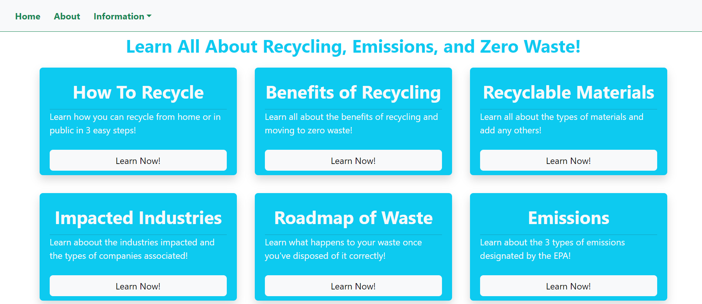
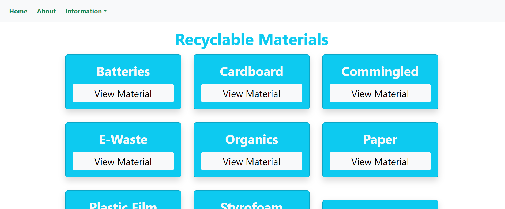
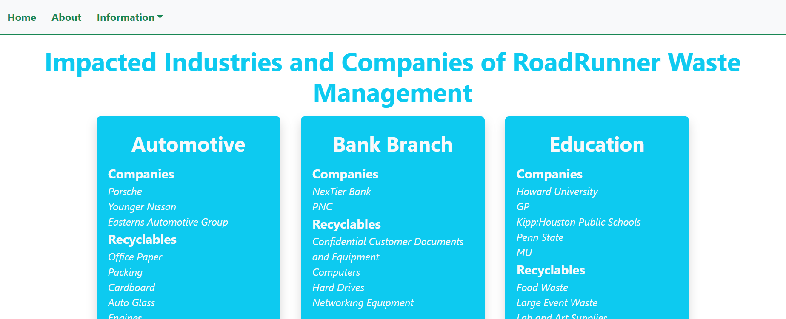
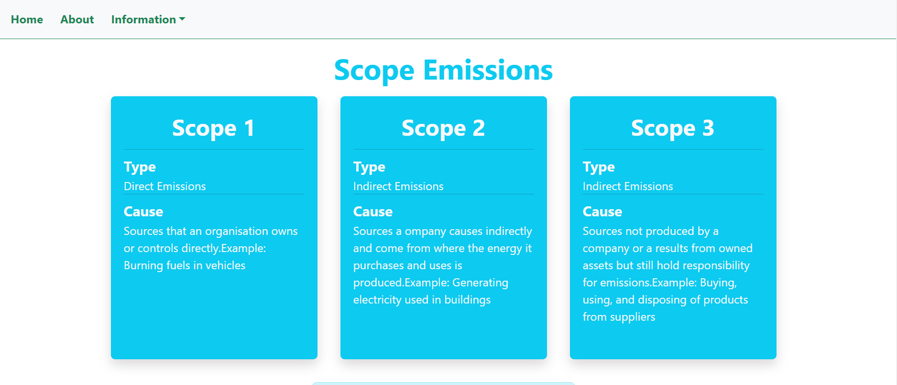
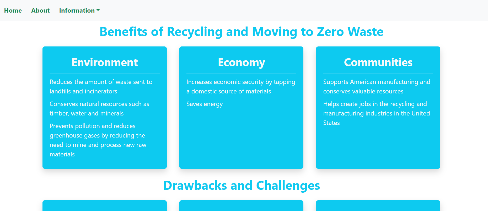
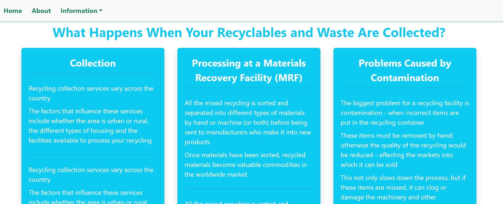
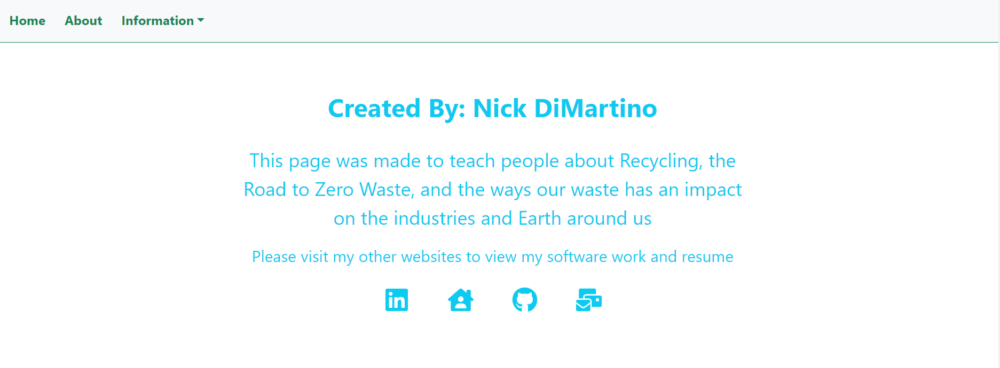

# <h1 align="center">Zero Waste and Recycling 101</h1>

 
  
 

## 📝 Description

Welcome to Zero Waste and Recycling! Learn how to recycle and the different types of recyclable materials on thhis web application. Read all about the industries impacted, the types of emissions, what happens to your waste, and how you can recycle too!

## 🖼️ Screenshots

 
 📊 App Web Pages

 
 | Description | Screenshot |
 |------------ | ------------|
 | <h3 align="center">Home Page</h3> | 
 | <h3 align="center">Home Page</h3> | 
 | <h3 align="center">Home Page</h3> | 
 | <h3 align="center">Home Page</h3> | 
 | <h3 align="center">Home Page</h3> | 
 | <h3 align="center">Home Page</h3> | 
 | <h3 align="center">Home Page</h3> | 
 | <h3 align="center">Home Page</h3> | 

 

## 💻 Technologies Used

## ⚛️ Getting Started

### 📲 Instructions

How to Navigate the App

1. Upon entering the web application, you will be shown a list of webpages you can visit to view information about the Road to Zero Waste and Recycling.

2. You can also use the navbar for the same navigation abilities.

3. On the materials page, you can also add, edit, and delete materials as you see fit.

4. View the About page to visit my social media pages.

### 🔗 Links

Comning soon...

## ⏭️ Next Steps

- [ ] Find and fix possible bugs
- [ ] Refactor code
- [ ] Add a recycling-related game